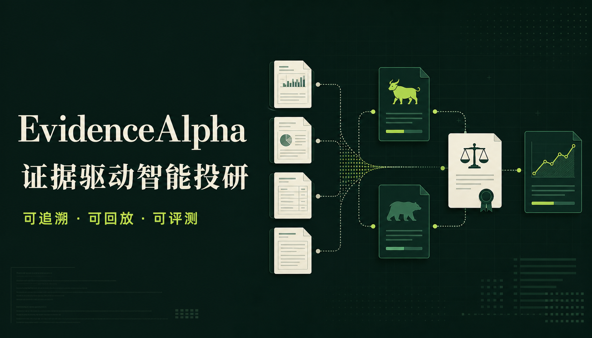
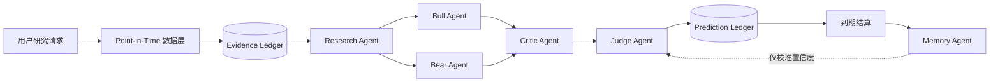

<div align="center">
  
  <h1>EvidenceAlpha</h1>
  <p><strong>证据驱动 · 时点隔离 · 多智能体辩论 · 可复现评测</strong></p>
  <p>面向 A 股事件研究的可审计多智能体投研系统</p>

  <p>
    <a href="https://github.com/weiasd51/EvidenceAlpha/actions/workflows/ci.yml"></a>
    <a href="https://github.com/weiasd51/EvidenceAlpha/blob/main/LICENSE"></a>
    
    
    
    
  </p>
</div>



## 🧠 项目概览

传统 Trading Agent 往往在生成“买入 / 卖出”后结束，却很难回答三个关键问题：**当时用了哪些证据、是否泄漏未来数据、多 Agent 是否真的优于单 Agent**。

EvidenceAlpha 将一次研究拆成“证据采集 → 多角色研判 → 审计裁决 → 预测登记 → 到期结算 → 复盘评测”的完整闭环。每个结论都保留研究时点、证据引用、Agent Trace、预测置信度、失效条件和结算结果，便于回放、审计与消融对比。

> **研究范式跃迁：** ❌ 只生成一次性观点 → ✅ 用证据账本、预测账本和结算结果持续验证观点

系统融合：

- 🧾 **Point-in-Time Evidence**：冻结研究时点，阻断未来数据泄漏
- ⚔️ **Multi-Agent Debate**：Bull / Bear 对抗，Critic 审计，Judge 收敛
- 🧠 **Memory Calibration**：只检索已经结算的同股票、同周期案例
- 📒 **Prediction Ledger**：预测方向、置信度、期限、基准和失效条件结构化落库
- 🧪 **Reproducible Evaluation**：相同样本、相同证据下完成三种模式消融实验
- 📊 **Research Dashboard**：可视化研究卡片、证据链、Agent 轨迹和评测指标

## ✨ 核心能力

| 模块 | 功能 | 说明 |
| --- | --- | --- |
| 🕒 时点层 | Point-in-Time 回放 | 仅允许使用 `published_at <= as_of` 的证据，避免未来数据污染 |
| 🧾 证据层 | Evidence Ledger | 保存证据来源、发布时间、立场、结构化负载和引用关系 |
| ⚔️ 推理层 | Multi-Agent Debate | Research、Bull、Bear、Critic、Judge 基于同一证据集协作 |
| 📒 预测层 | Prediction Ledger | 固化方向、置信度、期限、基准与失效条件，结算时只追加结果 |
| 🧠 记忆层 | Settled Memory | 仅按 `symbol + horizon_days` 召回研究时点前已结算案例 |
| 🧪 评测层 | Ablation Benchmark | 对比 Single、Debate、Debate+Memory，不预设多 Agent 一定更好 |
| 📈 指标层 | Calibration Metrics | 计算方向准确率、Brier Score、Calibration Gap 和超额收益 |
| 🖥️ 展示层 | Research Dashboard | 展示研究任务、证据资产、预测结算、Agent Trace 与模式对比 |
| 🔌 模型层 | OpenAI-compatible LLM | 可接入 GPT / DeepSeek / Qwen；失败时自动回退到确定性流程 |
| ⚙️ 工程层 | CI & Containers | Pytest、Ruff、Docker Compose、GitHub Actions 自动验证 |

## ⚔️ 智能体核心组件

| Agent | 职责 | 实现细节 |
| --- | --- | --- |
| **Research Agent** | 证据研究员 | 清洗、去重并检查时点证据，为后续角色建立统一 Evidence Ledger |
| **Bull Agent** | 看多研究员 | 仅基于正向证据提出经营改善、相对强势等可验证假设 |
| **Bear Agent** | 看空研究员 | 聚焦价格竞争、波动率与下行风险，形成独立反方论证 |
| **Critic Agent** | 风险审计员 | 检查证据是否越过研究时点、正反观点是否充分，并主动压低过度置信 |
| **Judge Agent** | 最终裁决者 | 汇总多方观点，输出 `signal`、`confidence`、研究结论和失效条件 |
| **Memory Agent** | 历史校准器 | 读取同股票、同预测周期的已结算案例，只用于置信度校准 |

### 1️⃣ 决策机制：从证据到账本



- **结构化对抗**：Bull 与 Bear 使用同一证据集，避免各自引入不可审计材料
- **证据约束**：LLM 只能引用 Evidence Ledger 中已经登记的证据
- **审计收敛**：Critic 检查时点边界和证据充分性，Judge 负责最终裁决
- **结果闭环**：预测创建后不改写原始方向与置信度，到期后追加结算结果

### 2️⃣ 三种实验模式

| 模式 | Agent 路径 | 研究目的 |
| --- | --- | --- |
| **Single** | Research → Bull → Judge | 单 Agent 快速基线 |
| **Debate** | Research → Bull / Bear → Critic → Judge | 检验结构化辩论是否改善决策 |
| **Debate+Memory** | Debate + Settled Memory → Judge | 检验历史结算案例能否改善置信度校准 |

### 3️⃣ 可审计数据模型

```text
Evidence ──< AnalysisEvidence >── AnalysisRun ── Prediction
   │                 │                  │              │
来源/时间/立场     相关度/使用者      Agent Trace     到期结果/Brier
```

## 🧪 可复现评测

项目内置确定性离线合成基准，用于验证研究、预测、结算、时点过滤与消融评测链路。**这些结果不是实际市场回测，也不代表投资收益。**

```powershell
python -m benchmarks.run_benchmark --write
```

| 指标 | 结果 |
| --- | ---: |
| 实验运行数 | **144** |
| 方向准确率 | **66.67%** |
| 总体 Brier Score | **0.2197** |
| Debate+Memory Brier Score | **0.2015** |
| Memory 相比 Debate 改善 | **12.20%** |
| 证据时点检查 | **576 条** |
| 未来证据违规 | **0 次** |
| 预测结算率 / 审计完整率 | **100% / 100%** |

三种模式结果：

| 模式 | 样本数 | 准确率 | Brier Score | Calibration Gap |
| --- | ---: | ---: | ---: | ---: |
| Single | 48 | 66.67% | 0.2280 | 0.0762 |
| Debate | 48 | 66.67% | 0.2295 | 0.0855 |
| Debate+Memory | 48 | 66.67% | **0.2015** | **0.0625** |

完整实验设计、指标定义和限制见 [评测说明](docs/EVALUATION.md)。

## 🧩 技术栈与扩展接口

| 类型 | 当前实现 | 可扩展方向 |
| --- | --- | --- |
| Backend | Python、FastAPI、SQLAlchemy、Pydantic、SQLite | PostgreSQL、Redis、Celery |
| Frontend | React、Next.js / Vinext、TypeScript | 实时流式事件、更多可视化图表 |
| LLM | OpenAI-compatible API，可选真实模型 | GPT、DeepSeek、Qwen、Gemini 等适配器 |
| 数据 | 确定性演示 Provider、Point-in-Time 过滤 | AkShare、Tushare、自定义行情 / 公告 Provider |
| Evaluation | Pytest、离线合成 Benchmark、Brier / Calibration | 真实历史数据回放、分层样本评测 |
| Engineering | Ruff、Docker Compose、GitHub Actions | OpenTelemetry、任务队列与生产监控 |

## 🚀 快速开始

### 方式一：Docker Compose

```bash
git clone https://github.com/weiasd51/EvidenceAlpha.git
cd EvidenceAlpha
docker compose up --build
```

- Web：<http://localhost:5173>
- API 文档：<http://localhost:8000/docs>

### 方式二：Windows 本地脚本

```powershell
git clone https://github.com/weiasd51/EvidenceAlpha.git
cd EvidenceAlpha
./scripts/setup.ps1
./scripts/start-backend.ps1
./scripts/start-frontend.ps1
```

如需连接真实模型，复制 `.env.example` 为 `.env`，配置 `LLM_API_KEY`、`LLM_BASE_URL` 和 `LLM_MODEL`。请勿将 `.env` 提交到 GitHub。

## 📡 API 示例

```bash
curl -X POST http://localhost:8000/api/v1/analyses \
  -H "Content-Type: application/json" \
  -d '{"symbol":"300750","query":"分析近期事件","horizon_days":5,"mode":"debate"}'
```

| 接口 | 用途 |
| --- | --- |
| `POST /api/v1/analyses` | 创建研究任务与预测卡 |
| `GET /api/v1/analyses` | 查询研究历史与 Agent Trace |
| `GET /api/v1/evidence` | 查询证据账本 |
| `GET /api/v1/predictions` | 查询预测及结算状态 |
| `POST /api/v1/predictions/{id}/settle` | 结算指定预测 |
| `GET /api/v1/metrics` | 获取准确率、Brier Score 等指标 |
| `GET /api/v1/dashboard` | 获取投研看板聚合数据 |

## ✅ 自动化验证

```powershell
python -m pytest --cov=backend --cov-report=term-missing
ruff check backend benchmarks tests
cd frontend
npm test
```

- 后端自动化测试：**7 项全部通过**
- 后端语句覆盖率：**85%**
- 前端构建与 SSR 测试：通过
- GitHub Actions：自动执行后端与前端验证

## 🗂️ 项目结构

```text
backend/                FastAPI、数据模型和多 Agent 研究工作流
benchmarks/             可复现离线基准、结果 JSON 与 Markdown 报告
frontend/               React 投研看板
tests/                  API、时点过滤与评测回归测试
docs/                   架构、评测方法、贡献指南和面试材料
scripts/                Windows 一键启动与状态管理脚本
.github/workflows/      GitHub Actions 持续集成
docker-compose.yml      本地容器部署
```

## 🤝 参与贡献

欢迎各种形式的贡献！详见 [贡献指南](docs/CONTRIBUTING.md)。

## 📄 许可证

本项目基于 [MIT License](LICENSE) 开源。

## ⭐ Star 历史

[](https://star-history.com/#weiasd51/EvidenceAlpha&Date)

**如果觉得有用，请给个 ⭐ Star 支持一下！**

## ⚠️ 免责声明

**本项目仅供学习和研究使用，不构成任何投资建议。股市有风险，投资需谨慎。作者不对使用本项目产生的任何损失负责。**

## 🙏 致谢

- [DSA](https://github.com/ZhuLinsen/daily_stock_analysis) - `daily_stock_analysis` 项目
- [AkShare](https://github.com/akfamily/akshare) - 股票数据生态
- [Google Gemini](https://ai.google.dev/) - AI 分析引擎生态
- [Tavily](https://tavily.com/) - 新闻搜索 API 生态
- 所有为项目做出贡献的开发者

## 📞 联系方式

- GitHub Issues：[报告 Bug 或提出建议](https://github.com/weiasd51/EvidenceAlpha/issues)
- Discussions：[参与讨论](https://github.com/weiasd51/EvidenceAlpha/discussions)
